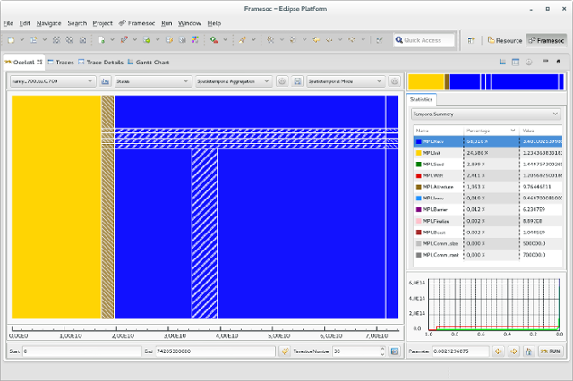

#Ocelotl Analysis Tool

### Update Site

This is the easiest way to start with Ocelotl.
First, [download](https://www.eclipse.org/) a version of Eclipse.
Then, install Ocelotl in Eclipse using the following procedure: Go to _Help > Install New Software_. In the new window, put the following URL in the field _Work with:_ 

http://dosimont.github.io/ocelotl/updatesite/

and press Enter. The Framesoc and Ocelolt tools should then be available. If Framesoc is not already installed in your Eclipse, select both tools. Then click on _Next_, _Next_, accept the license agreement and click on _Finish_.

### Download the Sources
[List of releases](https://github.com/dosimont/ocelotl/releases)

### User Guide
Check our [user guide](https://github.com/dosimont/ocelotl/wiki/User-Guide) to install, configure and use Ocelotl.

### Support or Contact
You can contact us by email:

[Damien Dosimont] (mailto:damien.dosimont_at_imag.fr),
[Youenn Corre] (mailto:youenn.corre_at_inria.fr),
[Generoso Pagano] (mailto:generoso.pagano_at_inria.fr) (replace _at_ by @)

### Ocelotl User List
You can subscribe to the Ocelotl user list using this [form](http://lists.gforge.inria.fr/cgi-bin/mailman/listinfo/ocelotl-users)
and post a message to the list members by sending an email to
[ocelotl-users[at]lists.gforge.inria.fr](mailto:ocelotl-users[at]lists.gforge.inria.fr)
